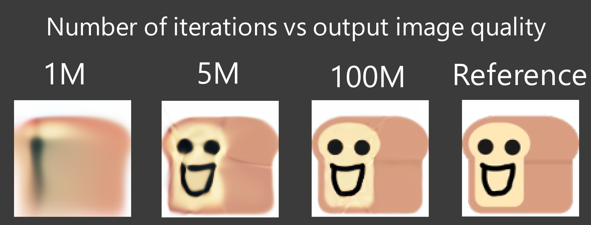
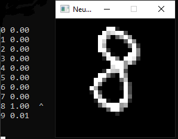
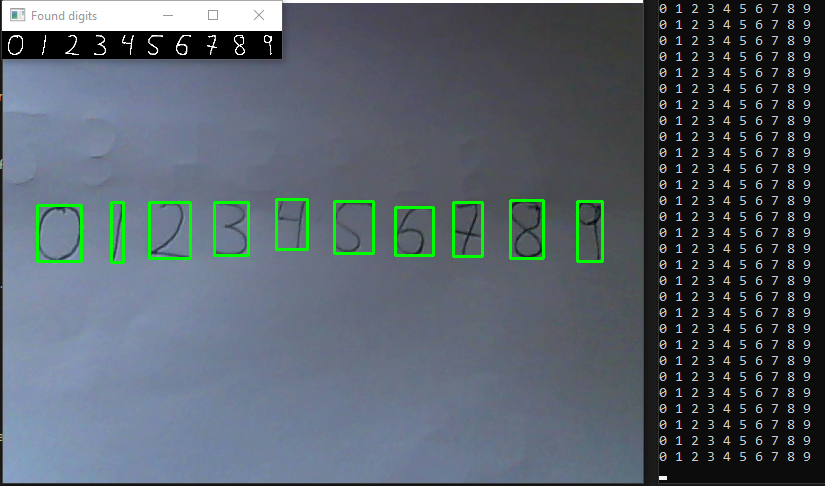

# DeepPotato
Simple neural network

## Build
```
mkdir build
cd build
cmake .. -DBUILD_XOR=ON -DBUILD_IMAGE_COMPRESSION=OFF -DBUILD_DIGITS=OFF
make
```
### Windows
```
mkdir build
cd build
cmake .. -G "NMake Makefiles" -DBUILD_XOR=ON -DBUILD_IMAGE_COMPRESSION=OFF -DBUILD_DIGITS=OFF
nmake
```
## Demo description

#### XOR
XOR demo is a simple neural network that learns XOR function.

#### Image compression
Image compression demo is a simple neural network that reproduces input image.   



#### Digit recognition
Artificial neural network that recognizes handwritten digits.  
Three types of tests are available:
* Test on MNIST dataset - slowly loops through test images by displaying single digit at a time and its prediction. (```#define AUTO_TEST```)	
* Manual test - allows to draw digit on the screen and see the prediction. (both ```#define AUTO_TEST``` and ```#define WEBCAM``` **NOT** defined)

* Web cam test - use camera to find and recognize digits (```#define AUTO_TEST``` **NOT** defined and ```#define WEBCAM``` defined, requires OpenCV installed and ```-DUSE_OPENCV=ON``` option set)				


Tests can be selected by adding or removing ```#define TEST``` and ```#define WEBCAM``` in ```demo/digits/main.cpp``` in the configuration section at the top of the file.
Pretrained model is available in ```demo/digits/models``` directory.
### Note
Additional dependencies are required for image compression and digit recognition demos.
```
cd demo/image_compression/external
git clone https://github.com/nothings/stb
git clone --depth 1 --branch SDL2 https://github.com/libsdl-org/SDL.git
```
